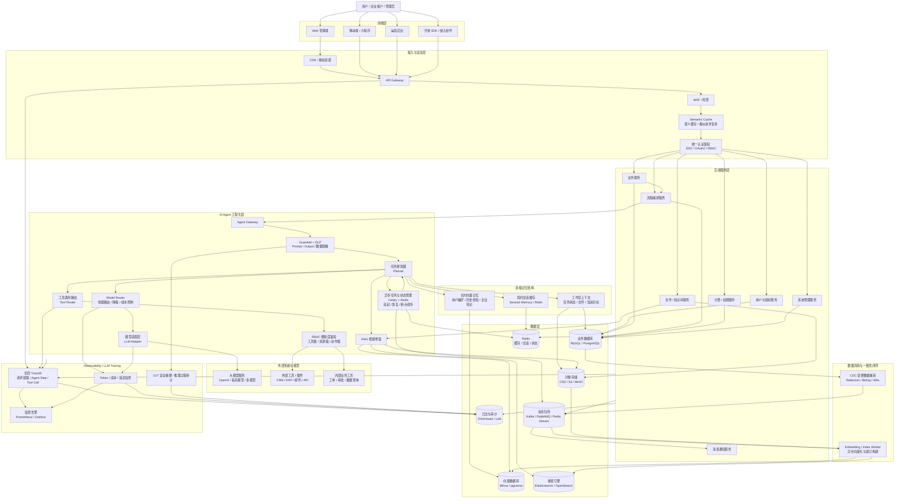

# 总体架构说明

## 文档目的与适用读者
- 面向新加入项目的研发人员、联调人员和需要快速理解系统边界的协作者。
- 重点说明系统分层、核心链路、部署骨架与推荐阅读路径。

## 当前实现范围
- 平台当前覆盖桌面端 Web 控制台、后端 API 服务、异步 Worker、数据库/缓存、玄武智能体与配套移动端接口。
- 研发交接主线聚焦 `situational-awareness/` 下的 Web 平台与后端服务，不展开 Flutter 移动端实现细节。

## 核心分层

### 企业级目标架构图

### 企业级架构增量
- Agent 工程化：在 Planner 外围增加基于 Celery + Redis 的异步任务与状态管理，用于长链条任务挂起、恢复、断点续传和执行边界收敛。
- 多级记忆：将单一记忆拆为短时会话缓存、工作区上下文和长时向量记忆，分别服务实时对话、任务恢复和跨会话知识沉淀。
- 模型治理：在 LLM Adapter 前增加 Model Router，统一处理模型路由、降级、成本控制和延迟策略。
- 安全边界：Guardrail 明确纳入 DLP 脱敏，工具调用链路增加 RBAC 细粒度鉴权，区分外部插件和内部业务工具。
- 数据一致性：通过 DB -> CDC -> MQ -> Embedding/Index Worker -> Vector/Search 的链路，实现业务数据与 RAG 知识库异步解耦同步。
- 高并发与观测：接入层增加 Semantic Cache，全链路观测升级为 Observability / LLM Tracing，覆盖 TraceID、Token、成本、延迟和 CoT 安全摘要。

### 1. 前端控制台
- 技术栈：Next.js 15、React 19、TypeScript、Ant Design 5。
- 负责：
  - 登录与控制台导航
  - 总览、发现、资产、风险、修复、漏洞库、任务、日志等页面
  - 玄武会话入口、浏览器上下文采集与前端安全交互

### 2. 后端 API 与业务服务
- 技术栈：FastAPI、SQLAlchemy 2、Pydantic 2。
- 负责：
  - 认证与鉴权
  - 资产、采集、风险、修复、任务、设置等业务接口
  - 平台日志、实时监控、运行时设置
  - 玄武智能体编排与审批控制

### 3. 异步任务与执行编排
- 技术栈：Celery 5、Redis。
- 负责：
  - 资产发现与深度扫描
  - 主机采集与风险验证
  - 修复执行与复验
  - 玄武触发的后端动作与长任务跟踪

### 4. 数据与运行时状态
- 技术栈：PostgreSQL 16、Redis 7。
- PostgreSQL 负责持久化：
  - 资产、端口、快照、风险发现
  - 任务运行与任务事件
  - 修复会话与 Runner
  - 玄武会话、目标、消息
  - 平台日志、规则索引与情报数据
- Redis 负责：
  - Celery broker/backend
  - 平台日志实时流
  - 设备异常告警推送

## 核心业务链路

### 资产发现链路
1. 前端提交 CIDR 到发现接口。
2. 后端创建发现任务和任务运行记录。
3. Worker 执行主机发现、资产入库、全端口扫描、服务探测与风险验证。
4. 结果回写资产、快照、风险与任务事件。
5. 前端从任务中心、资产页和总览页消费统一结果。

### 信息采集与风险识别链路
1. 用户为资产配置 SSH 凭据并做管理员权限验证。
2. 采集任务通过 `asyncssh` 获取系统信息、安装包、服务配置和主机安全检查结果。
3. 风险验证服务结合端口、配置与快照生成或更新 `risk_findings`。

### 修复闭环链路
1. 用户在修复工作台或玄武中准备修复会话。
2. 平台校验 Runner、SSH 授权、阶段条件和审批状态。
3. 修复步骤通过 SSH 执行器或 Host Runner 执行。
4. 平台记录步骤日志、备份路径、回滚工件和复验任务。
5. 前端通过修复任务流与会话流查看执行结果。

### 玄武智能体链路
1. 前端采集页面上下文、DOM 摘要和候选 UI 动作。
2. 后端创建/恢复玄武会话和当前目标。
3. Playbook 匹配决定读工具、UI 动作或写动作。
4. 高风险动作进入审批，敏感输入进入安全弹层。
5. 执行过程通过 WebSocket 把增量消息、任务进度和阻塞状态推回前端。

## 部署骨架
- 默认部署通过 Docker Compose 提供：
  - `frontend`
  - `backend`
  - `worker`
  - `postgres`
  - `redis`
  - `settings-helper`
- 显式开发模式提供：
  - `frontend-dev`
  - `backend-dev`
  - `worker-dev`

## 关键代码入口
- `frontend/src/components/AppShell.tsx`
- `frontend/src/services/api.ts`
- `backend/app/main.py`
- `backend/app/api/v1/router.py`
- `backend/app/core/celery_app.py`
- `backend/app/tasks/discovery_tasks.py`
- `backend/app/tasks/remediation_tasks.py`
- `backend/app/services/haor_agent_service.py`

## 配置、依赖与限制
- 默认环境依赖 Docker Compose、PostgreSQL、Redis。
- 前端通过 Next.js 代理访问后端；浏览器侧默认不直接暴露容器内部服务地址。
- 真实局域网验收需要目标网段可见性，Docker 默认 `bridge` 网络仅适合演示和基础联调。

## 相关文档
- 项目总入口：[../README.md](../README.md)
- 文档总索引：[README.md](README.md)
- 前端设计：[frontend-design.md](frontend-design.md)
- 后端设计：[backend-design.md](backend-design.md)
- 数据模型：[database-schema.md](database-schema.md)
- 接口说明：[api-contract.md](api-contract.md)
- 运行手册：[runbook.md](runbook.md)
